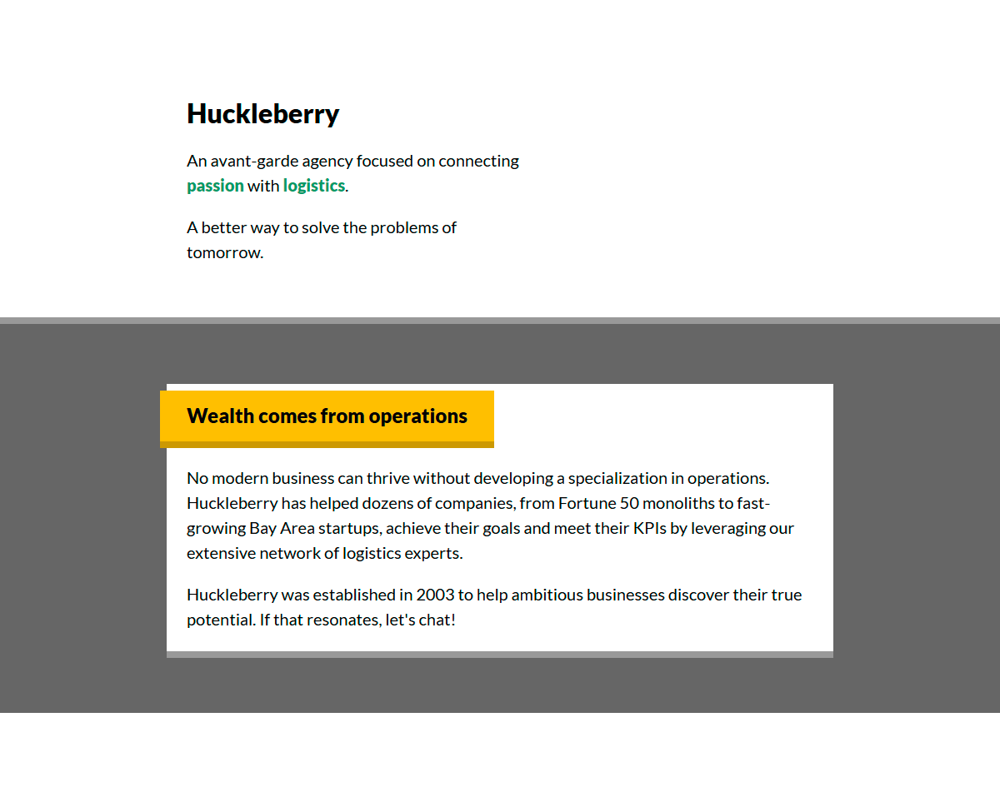

# CSS for JS

This repo contains my solutions to the exercises from Josh Comeau's course, "CSS for JavaScript Developers". Each folder represents a separate, independent workshop.

To run a local server and view a workshop in your browser, execute:

```
npm run start
```

or

```
bun run start
```

## Exercises

- Workshop 1: Agency Page

  